<p align="center">
  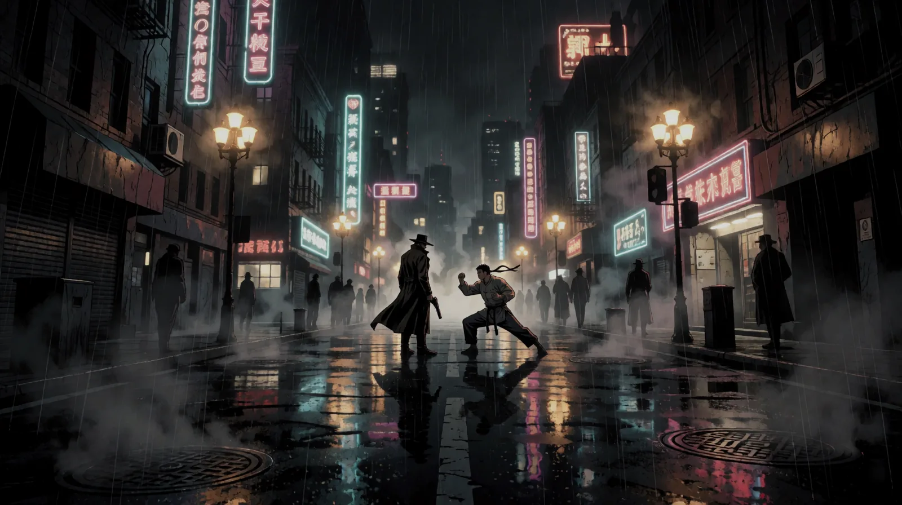
</p>

<h1 align="center">KINETIK</h1>
<p align="center"><b>Cinematic Action Roleplaying</b><br>Gun-Fu · Kampfkunst · Anime</p>

<p align="center">
  <a href="https://rec0il.github.io/KINETIK-PNP/"><b>Web-App öffnen</b></a> ·
  <a href="export/KINETIK_Regelwerk_v3.5.pdf"><b>Regelwerk als PDF</b></a> ·
  <a href="regelwerk/KINETIK_Regelwerk.md">Regeltext</a> ·
  <a href="CHANGELOG.md">Changelog</a>
</p>

Ein Pen-&-Paper-Regelwerk für grenzenlose, filmische Action. Schnelle, tödliche Kämpfe über ein **2W6-Clash-System**, in dem Angreifer und Verteidiger gegeneinander würfeln, und ein **Titel-System**, in dem Erfahrung mehr zählt als rohes Talent. Dazu eine Web-App, mit der ihr am Tisch oder online spielt: Charakterbogen, Karte, Musik, Würfel und ein Dashboard für die Spielleitung. Läuft im Browser, ohne Konto und ohne Server.

## Das Spiel in einer Minute

<table>
<tr>
<td width="46%" valign="top">
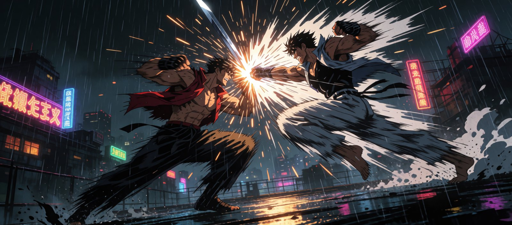
</td>
<td valign="top">

**Jede Probe: 2W6 + Attribut + Meisterschaft.** Meisterschaft kommt aus Titeln wie *Ex-Hitman* oder *BJJ-Schüler*, aber nur, wenn der Titel die Aktion abdeckt.

**Im Kampf würfeln beide Seiten.** Die Differenz Δ entscheidet:

| Δ (Angreifer − Verteidiger) | Ergebnis |
|---|---|
| 3 oder mehr | **Dominanz**: perfekter Treffer, Momentum |
| 0 bis 2 | **Schlagabtausch**: beide landen Treffer |
| −1 bis −2 | **Konter**: der Verteidiger schlägt zurück |
| −3 oder weniger | **Perfekter Konter** |

Keine Lebenspunkte: Treffer kosten **Schutz**, dann **Willenskraft**, und erst harte Treffer machen **Verletzungen** auf der Körpersilhouette. **Moves** sind Techniken, die ihr nach einem festen Raster aus Effektpunkten selbst baut.

</td>
</tr>
</table>

Alles Weitere steht im [Regelwerk](regelwerk/KINETIK_Regelwerk.md) (aktuell **v3.5**, Alpha, in aktiver Entwicklung).

## Die Web-App

**[rec0il.github.io/KINETIK-PNP](https://rec0il.github.io/KINETIK-PNP/)**: im Browser, auch offline nutzbar, auf Handy und Desktop.

<table>
<tr>
<td width="50%"><a href="https://rec0il.github.io/KINETIK-PNP/#/charaktere"></a><br><b>Spieler</b><br>Charakterbogen mit Assistent, Körpersilhouette, Moves und Würfeln. Speichert im Browser, Export als JSON.</td>
<td width="50%"><a href="https://rec0il.github.io/KINETIK-PNP/#/beitreten"></a><br><b>Runde beitreten</b><br>Mit dem Raumcode des SL. Bogen, Würfel, Karte und Musik teilen, direkt von Browser zu Browser (WebRTC).</td>
</tr>
<tr>
<td><a href="https://rec0il.github.io/KINETIK-PNP/#/sl"></a><br><b>Spielleiter</b><br>Spieler und Bögen sehen, Kampf mit Kinetik-Marker, Gegner, Handouts, Karte mit Nebel, Musik.</td>
<td><a href="https://rec0il.github.io/KINETIK-PNP/#/builder">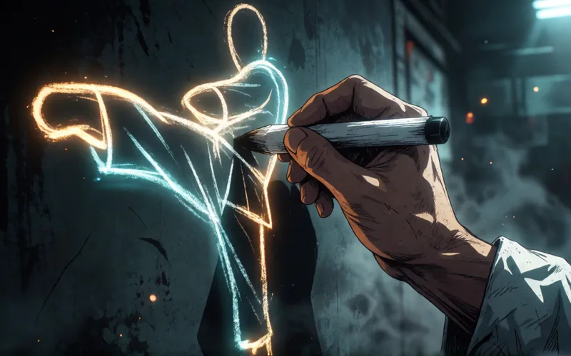</a><br><b>Move-Builder</b><br>Moves nach Kapitel 5 bauen: Effektpunkte, Kosten und Mindestlevel live, ohne Charakter nutzbar.</td>
</tr>
</table>

### Charakterbogen und Assistent

Alles, was die Regeln ableiten (Energie- und WK-Maximum, Momentum-Deckel, Meisterschaft, Move-Kosten), rechnet der Bogen selbst, und **jeder Wert lässt sich überschreiben**. Neue Charaktere starten mit der Kampagnenstartstufe (Straße, Kino, Legende oder eigene Budgets) und danach wahlweise mit dem **Assistenten** oder einem leeren Bogen.

<table>
<tr>
<td width="50%">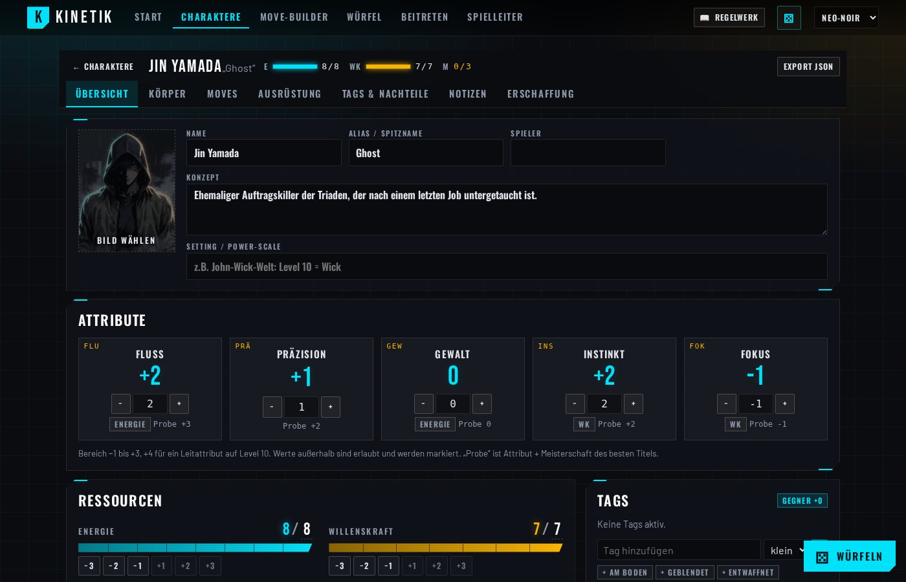<br><sub>Übersicht mit Attributen, Ressourcen und Tags</sub></td>
<td width="50%">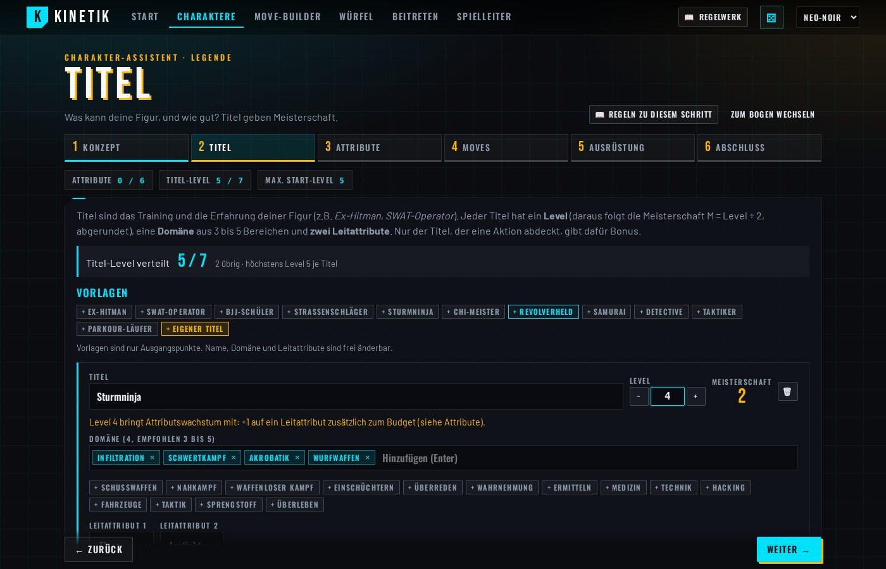<br><sub>Assistent mit Live-Budget und Titel-Vorlagen</sub></td>
</tr>
<tr>
<td>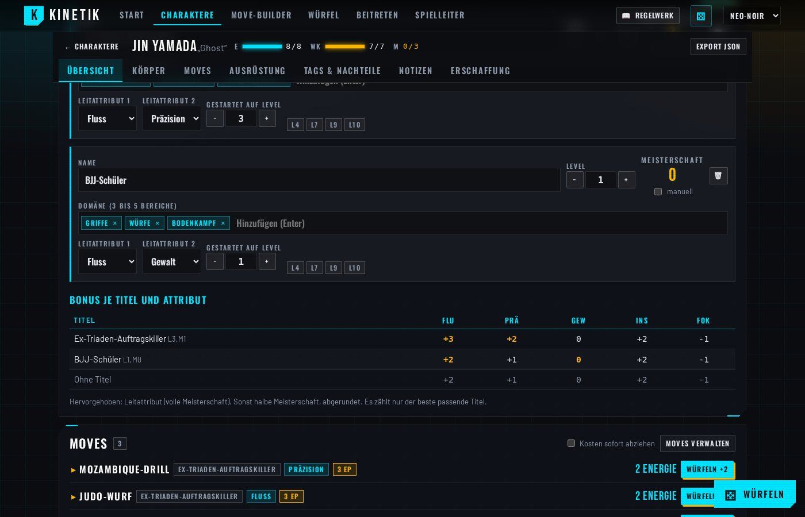<br><sub>Moves mit Kosten, grau bei zu wenig Energie oder Momentum</sub></td>
<td>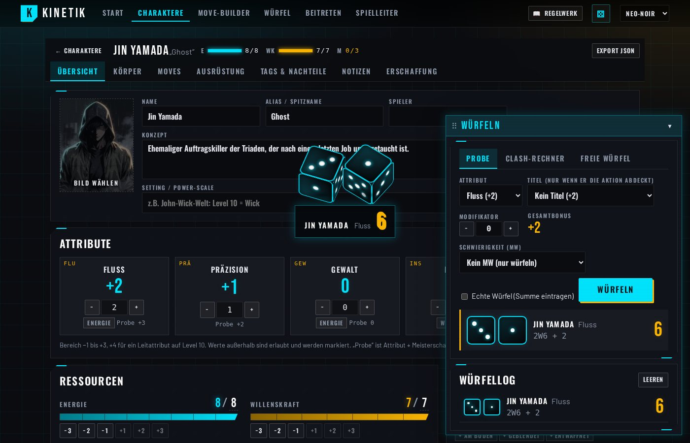<br><sub>Schwebendes Würfel-Fenster, 3D-Würfel für alle am Tisch</sub></td>
</tr>
</table>

### Spielleitung, Karte und Kampf

<table>
<tr>
<td width="50%">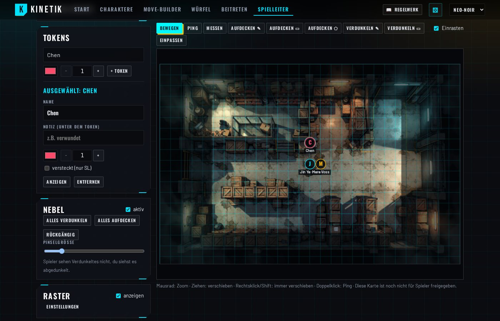<br><sub>Karte hochladen, Tokens setzen, Nebel aufdecken, an Spieler freigeben</sub></td>
<td width="50%">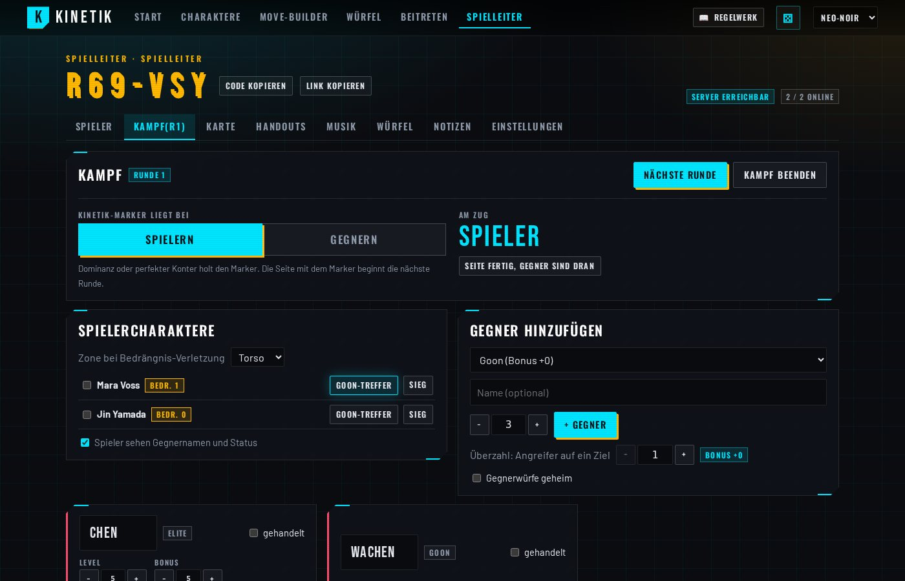<br><sub>Kampf mit Kinetik-Marker, Bedrängnis und Gegnern nach NPC-Leiter</sub></td>
</tr>
<tr>
<td>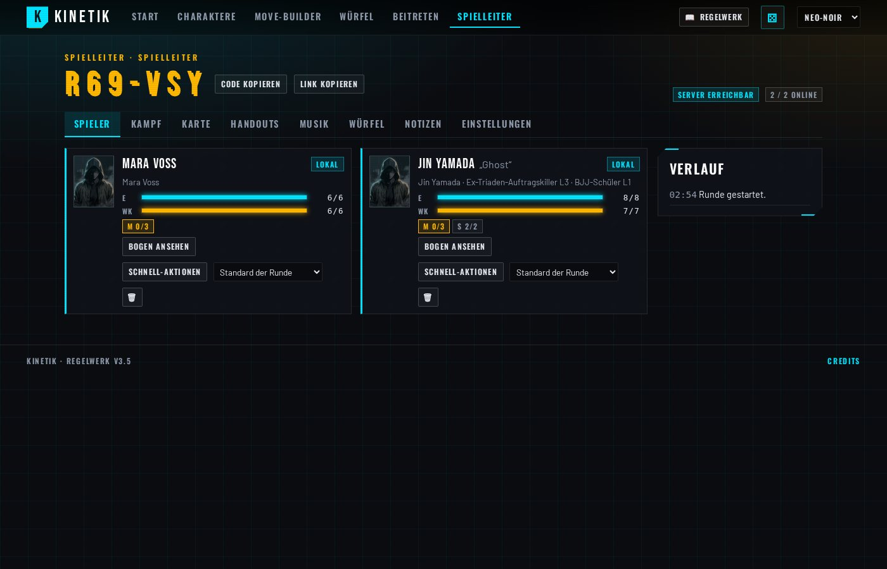<br><sub>Gruppe im Blick, Schnell-Aktionen und Sichtbarkeit der Bögen</sub></td>
<td>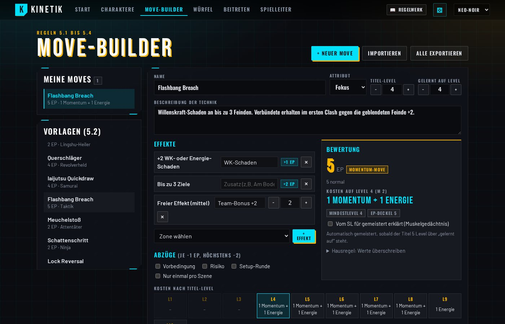<br><sub>Move-Builder mit Kosten nach Titel-Level</sub></td>
</tr>
</table>

### Das Regelwerk in der App

Der Knopf „Regelwerk“ öffnet das gesamte Regelwerk als Seitenleiste: gleiche Texte und Bilder wie das PDF, aber im Look der App, mit Suche und Sprungmarken. Der Charakter-Assistent springt zum passenden Kapitel.

<p align="center">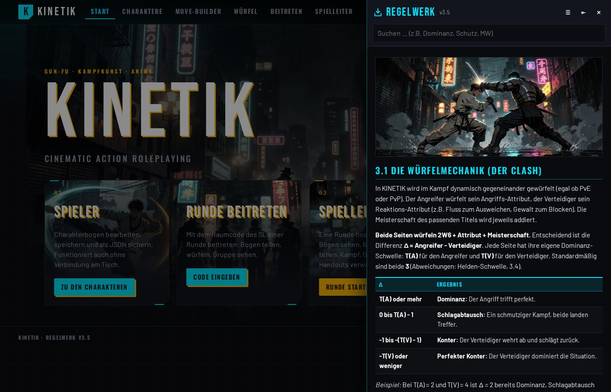</p>

### Was alles drinsteckt

- **Charakterbogen** mit Titeln und Bonus-Matrix, Körpersilhouette, Sterbend-Zähler, Schutz-Schild, Tags, Waffen, Notizen und JSON-Import/Export. Mehrere Charaktere pro Browser.
- **Multiplayer ohne Server**: Der SL-Tab ist der Host, Spieler treten mit Raumcode bei und der SL bestätigt. Wiederverbinden klappt von selbst.
- **Sichtbarkeit pro Runde einstellbar**: Gruppenleiste, Privat oder Offen. Der SL kann Werte direkt auf Spielerbögen anwenden.
- **Würfeln**: Probe gegen MW, Clash-Rechner mit Helden-Schwelle und Außer Reichweite, geheime SL-Würfe, 3D-Würfel, Log.
- **Karte**: Raster, Tokens, Nebel, Ping, Messen. Mehrere Szenen, eine davon live für die Spieler.
- **Musik** vom SL, für alle synchron, mit Überblendung (neun mitgelieferte Titel).
- **Kampf-Werkzeuge**: Seiten-Initiative, Bedrängnis, Gegner mit Schutz, Willenskraft und Verletzungen, Handouts.
- **Kampf auf der Karte**: Der SL stellt Gegner auf der Karte auf, Spieler fragen Bewegung an und planen ihre Aktion mit Ziel, Technik und Tags. Der SL gibt frei, vergibt Bullet Time und wickelt das Ergebnis mit einem Klick ab. Gift tickt am Rundenende.
- **Drei Looks** (Neo-Noir, Terminal, Hybrid), deutsche Oberfläche, Offline-Cache.

### So geht es los

**Spielen:** Seite öffnen, „Spieler“, Charakter anlegen (oder das Beispiel Jin laden) und ausfüllen. Zum Mitspielen: „Beitreten“, Raumcode und Namen eingeben.
**Leiten:** „Spielleiter“, „Runde starten“, den Raumcode oder Link an die Spieler schicken und den Tab offen lassen.
Wer im Büro- oder Uni-WLAN spielt, kann in den erweiterten Einstellungen einen eigenen Vermittlungs- oder TURN-Server eintragen. Details: [`tools/kinetik-vtt`](tools/kinetik-vtt/README.md).

## Das illustrierte PDF

<table>
<tr>
<td width="28%"><a href="export/KINETIK_Regelwerk_v3.5.pdf">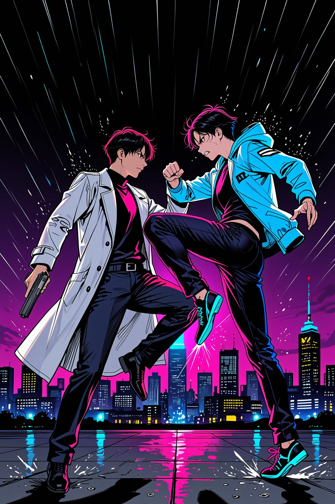</a></td>
<td valign="top">

Das Regelwerk gibt es als gesetztes Buch mit Cover, Kapitel-Bannern und einem Bild pro Abschnitt: [`export/KINETIK_Regelwerk_v3.5.pdf`](export/KINETIK_Regelwerk_v3.5.pdf). Gebaut wird es mit [`tools/rulebook-pdf`](tools/rulebook-pdf/README.md): Der Text kommt aus der Markdown-Datei, die Bild-Prompts schreibt ein LLM, die Bilder entstehen lokal mit ComfyUI (Krea 2), gesetzt wird mit WeasyPrint. Das Werkzeug kann auch fremde Regelwerke und andere Dokumente illustrieren.

</td>
</tr>
</table>

## Projektstruktur

```
KINETIK_PNP/
├── regelwerk/
│   ├── KINETIK_Regelwerk.md   Aktuelle Fassung (Quelle für PDF und App)
│   └── archiv/                Frühere Fassungen
├── data/                      Maschinenlesbare Regeldaten, gemeinsame Quelle für alle Tools
├── tools/
│   ├── kinetik-vtt/           Web-App (Svelte, TypeScript, WebRTC)
│   └── rulebook-pdf/          PDF-Export mit KI-Bildern
├── assets/                    Grafiken, PDF-Projekt mit Bildern und Prompts
├── docs/                      Prüfberichte, Designnotizen, Screenshots
├── export/                    Fertige PDFs
├── scripts/                   Hilfsskripte (Datenprüfung, Regelwerk für die App, Bilder, Screenshots)
└── .github/workflows/         Veröffentlichung auf GitHub Pages
```

## Entwickeln

```bash
cd tools/kinetik-vtt
npm install
npm run dev          # http://localhost:5173
npm test             # Regel-Engine gegen Beispiele und Wahrscheinlichkeitstabellen des Regelwerks
npm run check-data   # Regeldaten in data/ prüfen
npm run build
```

Nach Änderungen am Regelwerk: `python3 scripts/build_rulebook_web.py` (Regelwerk für die App neu bauen) und das PDF neu setzen. Ein Push auf `main` baut und veröffentlicht die App automatisch.

## Roadmap

- [x] Regelwerk v3: Meisterschaft, Clash, Schutz, Moves, Waffen
- [x] Regeldaten in `data/` als gemeinsame Quelle für alle Tools
- [x] Online-Charakterbogen mit Assistent und Move-Builder
- [x] Multiplayer mit Karte, Musik, Würfeln und Log (WebRTC)
- [x] SL-Dashboard (Initiative, Gegner, Bedrängnis, Kinetik-Marker, Handouts)
- [x] Druckversion (PDF) und Regelwerk in der App
- [x] Gift-Mechanik in der Web-App (3.11): Energieverlust am Rundenende, Verzögerung, Stufen, Gegenmittel-Probe, Überlauf-Zähler
- [x] Karte und Kampf verknüpft: Gegner als Token, Bewegung per Anfrage, geplante Aktionen als Kampfsituationen mit Freigabe, Bullet Time, Tags, Ein-Klick-Abwicklung
- [ ] Schnellreferenz

## Credits

- **Regelwerk und Idee**: Rec0iL
- **Bilder** (Hero, Kartenmotive, PDF, Beispielkarte): erzeugt mit Krea 2 in ComfyUI
- **Musik**: Kevin MacLeod ([incompetech.com](https://incompetech.com)), [CC BY 4.0](https://creativecommons.org/licenses/by/4.0/), siehe [`CREDITS.md`](tools/kinetik-vtt/public/music/CREDITS.md)
- **Schriften**: Barlow, Barlow Condensed, Bebas Neue, Oswald (Google Fonts, SIL OFL 1.1)
- **Software**: Svelte, Vite, PeerJS, idb-keyval

## Lizenz

| Was | Lizenz |
|---|---|
| Regeltext, Regeldaten (`regelwerk/`, `data/`), Bilder und Grafiken (`assets/`, `export/`, `tools/kinetik-vtt/public/art`, `public/rulebook`, `docs/screenshots`) | [CC BY-NC-SA 4.0](https://creativecommons.org/licenses/by-nc-sa/4.0/deed.de): teilen und bearbeiten ist erwünscht, mit Namensnennung, nicht kommerziell, unter gleichen Bedingungen |
| Quellcode (`tools/`, `scripts/`, `.github/`) | [MIT](LICENSE) |
| Mitgelieferte Musik | CC BY 4.0, Kevin MacLeod (siehe oben) |

Mehr dazu in [`LICENSE-CONTENT.md`](LICENSE-CONTENT.md).
