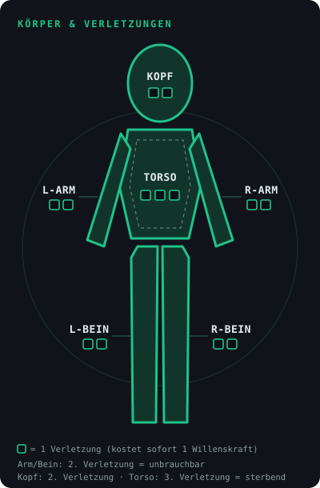

# **KINETIK: Cinematic Action Roleplaying**

*Ein Tabletop-Regelwerk für grenzenlose, filmische Action. Version 3.5.*

---

## **1. Grundphilosophie**

Dieses System belohnt Kreativität. Es bestraft Spieler nicht für coole Beschreibungen durch zusätzliche Erschwernisse, sondern ermutigt sie durch **Momentum** und **Bullet Time**. Kämpfe sind schnell, tödlich und cineastisch. Wir nutzen ein dynamisches "Clash"-System, bei dem Angreifer und Verteidiger die Klingen (oder Kugeln) kreuzen.

**Erfahrung zählt.** Talent öffnet die Tür, aber Titel (Training, Erfahrung, Meisterschaft) entscheiden, wer am Ende steht. Ein Hüne ohne Erfahrung wird keinen Großmeister niederringen.

**Detailgrad nach Geschmack.** Die Regeln funktionieren mit einer Handvoll grober Moves genauso wie mit einem kompletten Arsenal aus Taekwondo-, Karate- und Muay-Thai-Techniken. Solange jeder Move dem Raster aus Kapitel 5 folgt, entscheidet der Tisch, wie tief er gehen will.

**Power-Scale nach Setting.** Wie stark die Welt ist, wählt der SL frei. In einem John-Wick-Setting ist John Wick das Nonplusultra und damit Level 10, im Naruto-Universum gilt das Gleiche für den Naruto der Endphase, und im Jackie-Chan-Setting ist Jackie einer der fähigsten Kämpfer seines Stils. Das Titel-Level misst also immer den Rang **innerhalb des Settings**, nicht eine absolute Stärke. Ob Straßenkampf, Gun-Fu oder Ki-Schlachten: Dieselben 2W6 und dasselbe Raster für Moves tragen alles. Der Tisch entscheidet, wie hoch die Decke der Welt liegt.

---

## **2. Der Charakter**

### **2.1 Die Attribute (2W6-System)**

Bei einer Probe werden **2W6 + Attribut + Meisterschaft** geworfen. Die Meisterschaft zählt nur, wenn ein Titel die Aktion abdeckt (siehe 2.2). Attribute reichen von **-1 bis +3** (Obergrenze +4 durch einen Titel auf Level 10).

* **Fluss (Flow):** Akrobatik, weiche Kampfkünste, Ausweichen, nahtlose Bewegungen.
* **Präzision (Precision):** Scharfschützen, gezielte Treffer auf Schwachstellen, feine Tätigkeiten.
* **Gewalt (Force):** Brachiale Zerstörung, Körperkraft, unaufhaltsame Angriffe.
* **Instinkt (Instinct):** Reflexe, Wahrnehmung von Gefahren, Handeln aus dem Bauch.
* **Fokus (Focus):** Taktik, analytisches Denken, Deduktion, logisches Begreifen.

Attribute wachsen mit den Titeln (siehe 2.2, Attributswachstum).

### **2.2 Das Titel-System (Level 1 bis 10)**

Jeder Charakter besitzt Titel (z.B. *Ex-Hitman*, *SWAT-Operator*). Ein Titel besteht aus:

* **Level (1-10):** Der Grad der Erfahrung.
* **Domäne:** 3 bis 5 Schlüsselbereiche, in denen der Titel gilt (z.B. *Ex-Hitman*: Schusswaffen, Infiltration, Einschüchtern).
* **2 Leitattribute:** Die Attribute, die der Titel typischerweise nutzt (z.B. *BJJ-Schüler*: Fluss und Gewalt).

**Nur der Titel, der eine Fähigkeit abdeckt, gibt dafür einen Bonus.** Ein Ex-Killer ist kein Judoka: Für einen Judo-Wurf zählt der Titel *BJJ-Schüler*, nicht der *Ex-Triaden-Auftragskiller*, auch wenn dieser höher ist. Aktionen, die kein Titel abdeckt, laufen mit Level 0, also nur mit dem Attribut.

**Meisterschaft (M) = Level ÷ 2, abgerundet.** Sie wird als Bonus auf den Wurf addiert, wenn die Aktion zur Domäne passt, und senkt die Energiekosten von Moves aus der Domäne (siehe 5.1).

| Level | 1 | 2 | 3 | 4 | 5 | 6 | 7 | 8 | 9 | 10 |
|---|---|---|---|---|---|---|---|---|---|---|
| Meisterschaft | 0 | 1 | 1 | 2 | 2 | 3 | 3 | 4 | 4 | 5 |

**Regeln zur Anwendung:**

* **Wurf in der Domäne:** 2W6 + Attribut + Meisterschaft.
* **Nicht-Leitattribut:** Nutzt eine Aktion ein anderes Attribut als die beiden Leitattribute des Titels, zählt nur die halbe Meisterschaft (abgerundet). Auf Level 1 bis 3 ist das 0, Titel wirken dort also nur über ihre Leitattribute.
* **Mehrere passende Titel:** Es zählt der höchste, die Meisterschaften werden nicht addiert.

**Attributswachstum:** Erreicht ein Titel Level **4, 7, 9 und 10**, steigt je ein **Leitattribut** dieses Titels um +1 (Wahl des Spielers). Die Obergrenze liegt bei +3. Stehen beide Leitattribute schon auf +3, darf der Punkt auf ein beliebiges anderes Attribut gehen. Auf Level 10 darf ein Leitattribut die Grenze durchbrechen und auf +4 steigen.

**Beispielkurve** (ein Titel, Leitattribut startet bei +2):

| Titel-Level | Attribut | Meisterschaft | Bonus in der Domäne |
|---|---|---|---|
| 1 | +2 | 0 | +2 |
| 3 | +2 | 1 | +3 |
| 4-5 | +3 | 2 | +5 |
| 6-7 | +3 | 3 | +6 |
| 8-9 | +3 | 4 | +7 |
| 10 | +4 | 5 | +9 |

**Level-Meilensteine:**

| Level | Freischaltung |
|---|---|
| 4, 7, 9, 10 | Attributswachstum (wirkt über die Attribute auch auf Energie und Willenskraft) |
| 5 | Momentum-Deckel +1 |
| 8-9 | Meister-Moves (bis 7 EP) |
| 10 | Legendäre Moves, Momentum-Deckel +1, Mindestkosten für Moves entfallen |

**Level-Tempo:** Der SL vergibt Level-Ups durch *Learning by Doing*, *Cineastisches Ausspielen* oder *Trainingsmontagen* in der Downtime. Richtwerte: Level 2 und 3 gehen schnell (etwa eine Session je Level), Level 4 bis 6 brauchen jeweils einen Story-Abschnitt, Level 7 bis 10 werden nur über Meilensteine vergeben.

### **2.3 Ressourcen & Verletzungen**

1. **Körper & Verletzungen:** Es gibt keine klassischen Lebenspunkte. Ein harter Treffer resultiert in einer narrativen Verletzung auf der Körpersilhouette (z.B. *Schulter durchschossen*, *Knie zertrümmert*), was bestimmte Aktionen verbietet. Die Silhouette hat sechs Zonen: Kopf, Torso, linker Arm, rechter Arm, linkes Bein, rechtes Bein.
   * **Arme und Beine:** Die zweite Verletzung macht die Gliedmaße unbrauchbar.
   * **Kopf:** Die zweite Verletzung macht die Figur sterbend.
   * **Torso:** Er ist robuster und hält 3 Verletzungen, die dritte macht die Figur sterbend.
   * **Schock:** Jede Verletzung kostet sofort 1 Willenskraft.
   * **Zonenwahl:** Bei einer normalen Verletzung wählt der SL die Zone passend zur Beschreibung des Angreifers. Der Spieler wählt selbst nur mit einem Move ("Zone wählen") oder über Bullet Time (siehe 3.9).
   * *Sondermanöver "Knochenbinde" (2 Willenskraft):* Der Schmerz wird temporär weggedrückt, das Körperteil ist für eine Aktion voll belastbar.

    

2. **Schutz (Rüstung & Glück):** Ein Wert von 0 bis 3. Schutz ist **kontextabhängig** (er wirkt nur gegen passende Angriffsarten, z.B. gilt ein ballistischer Anzug gegen Kugeln, nicht gegen einen brachialen Tritt). Er funktioniert als **Schwelle**:
   * **Schutz wird auf die Verletzungs-Schwelle angerechnet.** Eine Verletzung braucht eine Differenz von mindestens **Dominanz-Schwelle + Schutz** (siehe 3.2). Schutz 2 bedeutet also: Verletzung ab Differenz 5 statt 3.
   * **Abnutzung:** Jeder Treffer, der den Schutz nicht durchschlägt, kratzt ihn um 1 an (bis zum Ende der Szene). Mit 0 Schutz geht der Schaden auf die Willenskraft (siehe Kaskade in 3.2).
   * **Wiederherstellen:** Am Ende der Szene (kurze Rast) ist der Schutz wieder voll, im Kampf nur durch Moves.
   * **Durchschlag:** Moves können den Schutz für diesen Clash senken, ignorieren oder zerstören.
   * **Waffen und Deckung** senken oder ergänzen den Schutz, siehe 2.5.
3. **Willenskraft (WK):** Die Kampfmoral. Maximum: **6 + Instinkt + Fokus** (steigt mit den Attributen). Sinkt durch Schock (Verletzungen), extreme Schmerzen, Demoralisierung und Einschüchterung. Bei 0 ist man **Gebrochen** (siehe 3.10).
4. **Energie (Chi / Ausdauer):** Der Treibstoff. Maximum: **6 + Fluss + Gewalt** (steigt mit den Attributen). Teure Moves kosten Energie. Sinkt außerdem durch Atemnot, Lähmung und Erschöpfung (z.B. Würgegriffe, Nervenstöße). Bei 0 ist man **Ausgepumpt** (siehe 3.10).
5. **Momentum:** Siehe 3.8.

Energie und Willenskraft steigen nie über ihr Maximum.

### **2.4 Charaktererschaffung**

| Kampagnenstufe | Attribut-Budget | Titel-Level-Budget | Max. Start-Level je Titel |
|---|---|---|---|
| Straße | 3 | 3 | 2 |
| **Kino (Standard)** | **4** | **4** | **3** |
| Legende | 5 | 7 | 5 |

* **Attribute:** Alle starten bei 0. Das Maximum zum Start ist +2, ein **Naturtalent** darf auf einem Attribut +3 haben. Ein Attribut auf -1 gibt 1 Punkt zurück (bei höchstens zwei Attributen).
* **Titel:** Die Level-Punkte werden auf die Titel verteilt. Pro Titel werden Domäne (3 bis 5 Bereiche) und 2 Leitattribute festgelegt.
* **Titel über Level 4:** Startet ein Titel bei der Erschaffung auf Level 4 oder höher (nur in der Stufe *Legende* möglich), bringt er sein Attributswachstum gleich mit. Dieses +1 kommt zusätzlich zum Attribut-Budget und darf das Startmaximum von +2 auf +3 heben.
* **Ressourcen:** Energie = 6 + Fluss + Gewalt, Willenskraft = 6 + Instinkt + Fokus.
* **Startbonus:** Ein Kino-Charakter hat in seiner Domäne meist **+3** (Attribut +2, Meisterschaft 1).

### **2.5 Waffen & Deckung**

**Die Waffe bestimmt das Profil, der Titel bestimmt das Können.** Ein Meisterscharfschütze, der auf 2 km trifft, trifft mit einer Pistole genauso: Ein Titel mit der Domäne "Schusswaffen" deckt jede Schusswaffe ab. Es gibt **keine Reichweiten-Mali**. Schusswaffen funktionieren auch im Nahkampf (Gun-Fu): Läufe werden weggedrückt, Magazine herausgezogen, Schüsse knallen links und rechts am Ohr vorbei. Ein Nahkampf-Duell zwischen einem Scharfschützen mit .50 und einem Akimbo-Pistolero ist ausdrücklich erwünscht.

**Waffen sind tödlich.** Jede echte Waffe hat zwei Dinge:

1. **Durchschlag 1** bei jedem Angriff: Der Schutz des Ziels sinkt für diesen Clash um 1.
2. **Ein Profil:** ein Gratis-Effekt aus dem EP-Katalog (5.1). Leichte Waffen haben 1 EP, schwere 2 EP. Das Profil wirkt bei jedem Angriff mit dieser Waffe kostenlos, wie der Hauptteil eines Moves ab Schlagabtausch (3.2).

| Waffe | Klasse | Profil |
|---|---|---|
| Pistole | leicht (1 EP) | Zone wählen |
| Messer | leicht (1 EP) | +2 Energie-Schaden (Schmerz, Blutverlust) |
| Schlagstock / Tonfa | leicht (1 EP) | kleiner Tag *Benommen* |
| Akimbo-Pistolen | schwer (2 EP) | zweites Ziel, Zone wählen |
| Sturmgewehr | schwer (2 EP) | zweites Ziel, +1 Schutz-Schaden |
| Schrotflinte | schwer (2 EP) | zweites Ziel, kleiner Tag *Am Boden* |
| Scharfschützengewehr (.50) | schwer (2 EP) | **Durchschlag 2** statt 1, kleiner Tag *Benommen* (Druckwelle) |
| Katana | schwer (2 EP) | Zone wählen, +1 Schutz-Schaden |

* **Mit Moves kombinieren:** Profil und Durchschlag der Waffe gelten zusätzlich zu einem Move. Doppelte Effekte zählen nur einmal, und Durchschlag entfällt, wenn der Move den Schutz ohnehin ignoriert oder zerstört.
* **Eigene Waffen:** Der SL baut weitere Profile nach demselben Muster.

**Tödliche Hände:** Ein waffenloser Kampfkunst-Titel ab **Level 4** macht Hände und Füße zur Waffe: Sie erhalten **Durchschlag 1** (aber kein Profil). So bleiben Kampfkünstler gegen Bewaffnete konkurrenzfähig.

**Deckung:** Deckung ist eine Schutzart gegen Schüsse: **Holztisch 1, Autotür 2, Betonsäule 3**. Sie nutzt sich ab wie Schutz (Holz splittert, Glas zerspringt), wirkt nicht im Nahkampf und endet, sobald man sie verlässt. Deckung und Rüstung addieren sich nicht, es zählt der höhere Wert. Moves wie der Querschläger ignorieren Deckung.

**Verschleiß und Komplikationen:** Der SL entscheidet, wie lange Waffen halten. Er bringt Komplikationen typischerweise als kleinen Tag über den Schlagabtausch-Nachteil ein: *Ladehemmung*, *Magazin leer*, *Klinge steckt im Knochen fest*, *Lauf weggedrückt*, *Verschmutzt* (Durchschlag entfällt, bis die Waffe gereinigt ist). Große Komplikationen (Waffe bricht, Klinge wird stumpf und verliert ihr Profil) kommen als Preis eines legendären Moves, als "Erfolg mit Preis" oder schleichend über eine Story. Kleine Waffen-Tags lassen sich mit der Kinetik-Regel umdrehen: Das herausgezogene Magazin wird in der Luft gefangen und direkt zurück in den Magwell gedroppt.

**Härtegrad (optional):** Für besonders tödliche Runden: Ein Waffentreffer gegen ein Ziel **ohne passenden Schutz** verursacht schon bei Δ = T - 1 (dem obersten Schlagabtausch-Wert) eine Verletzung.

---

## **3. Der Kampf (Das Clash-System)**

### **3.1 Die Würfelmechanik (Der Clash)**

In KINETIK wird im Kampf dynamisch gegeneinander gewürfelt (egal ob PvE oder PvP). Der Angreifer würfelt sein Angriffs-Attribut, der Verteidiger sein Reaktions-Attribut (z.B. Fluss zum Ausweichen, Gewalt zum Blocken). Die Meisterschaft des passenden Titels wird jeweils addiert.

**Beide Seiten würfeln 2W6 + Attribut + Meisterschaft.** Entscheidend ist die Differenz **Δ = Angreifer - Verteidiger**. Jede Seite hat ihre eigene Dominanz-Schwelle: **T(A)** für den Angreifer und **T(V)** für den Verteidiger. Standardmäßig sind beide **3** (Abweichungen: Helden-Schwelle, 3.4).

| Δ | Ergebnis |
|---|---|
| **T(A) oder mehr** | **Dominanz:** Der Angriff trifft perfekt. |
| **0 bis T(A) - 1** | **Schlagabtausch:** Ein schmutziger Kampf, beide landen Treffer. |
| **-1 bis -(T(V) - 1)** | **Konter:** Der Verteidiger wehrt ab und schlägt zurück. |
| **-T(V) oder weniger** | **Perfekter Konter:** Der Verteidiger dominiert die Situation. |

*Beispiel:* Bei T(A) = 2 und T(V) = 4 ist Δ = 2 bereits Dominanz, Schlagabtausch umfasst nur 0 bis 1, Konter reicht von -1 bis -3, und erst ab -4 kommt ein perfekter Konter.

* **Dominanz:** Voller Effekt, siehe 3.2. Der Angreifer erhält **+1 Momentum** und **+1 Energie** (Einschränkungen in 3.10). Der Verteidiger hat keine Chance auf einen Gegenschlag.
* **Schlagabtausch:** Der Angreifer entscheidet: Entweder er zieht seinen Angriff durch und *beide* Seiten erleiden einen normalen Treffer, ODER er zieht seinen Angriff durch, aber **der SL gibt ihm einen kleinen Tag** als taktischen Nachteil (z.B. *Waffe klemmt*, *aus der Balance*, *Deckung verloren*), den der Gegner ausnutzen kann (siehe 3.3).
  * Gleichstand (Δ = 0) geht an den Angreifer und zählt als Schlagabtausch.
* **Konter:** Der Angriff geht ins Leere oder wird abgewehrt. Der Verteidiger übernimmt die Kontrolle und landet einen normalen Treffer auf den Angreifer. Kein Momentum-Gewinn für den Angreifer.
* **Perfekter Konter:** Der Verteidiger wirkt wie bei einer Dominanz (die Differenz wird aus seiner Sicht gelesen). Er erhält **+1 Momentum** und **+1 Willenskraft**.

### **3.2 Die Wirkung eines Treffers (Kaskade)**

Ein Angriff ohne Move macht **Standardschaden** nach der Kaskade **Schutz → Willenskraft → Verletzung**:

* **Normaler Treffer** (Schlagabtausch, Konter): **-1 Schutz** des Ziels (nur wenn ein passender Schutz über 0 vorhanden ist), sonst **-1 Willenskraft**.
* **Dominanz** (Δ ≥ T): **Verletzung**, wenn Δ ≥ **T + Schutz**. Reicht die Differenz nicht, wird der Treffer abgefangen (-1 Schutz und -1 Willenskraft).
* **Momentum** gibt es bei Δ ≥ T, unabhängig vom Schutz. Rüstung bremst also nie die Dynamik.

**Wann wirken Moves?**

* **Der Hauptteil eines Moves wirkt schon ab Schlagabtausch** (Δ ≥ 0): Tags, Schutz ignorieren oder zerstören, Schaden an Energie oder WK, zusätzliche Ziele.
* **Verletzungen und Momentum bleiben der Dominanz vorbehalten**, außer der Move hat den Effekt "Verletzung auch ohne Dominanz".
* **Für den Verteidiger** gilt dasselbe: Seine Moves wirken beim Konter, Verletzungen erst beim perfekten Konter.
* **Ausnahme:** Legendäre Moves brauchen immer Dominanz (siehe 5.4).

### **3.3 Tags**

Tags beschreiben Zustände wie *Am Boden*, *Entwaffnet*, *Geblendet* oder *Fixiert*.

* **Kleiner Tag:** Der Gegner erhält **+1** auf jeden Clash, in dem er den Tag ausnutzen kann (z.B. gegen jemanden, der *Am Boden* liegt).
* **Großer Tag:** Der Gegner erhält **+2**, oder die betroffene Aktion ist ganz verwehrt (*Fixiert*: keine Bewegung, *Gewürgt*: keine Worte, kein Durchatmen).
* **Stapeln:** Tags summieren sich, aber höchstens auf **+3** pro Clash.
* **Aufheben:** Ein Tag endet mit einer passenden Aktion (Aufstehen, Waffe aufheben, Augen freiwischen) oder mit der Szene.
* **Die Kinetik-Regel:** Einen **eigenen kleinen Tag** können Spieler durch eine kreative Beschreibung umdrehen. Der Tag verschwindet, und der Gegner erhält einen passenden kleinen Tag. *Beispiel:* Jin hat *Ladehemmung*. Statt nachzuladen, schnippt er die heiße Hülse ins Gesicht des Gegners: Die Ladehemmung ist weg, der Gegner ist *Geblendet*. Große Tags lassen sich nicht umdrehen.
* **Heimspiel:** Ein kleiner Tag ist nur ein Nachteil, wenn der Betroffene die Lage nicht beherrscht. Deckt ein **Titel des Charakters die Lage ab**, gibt der kleine Tag dem Gegner kein +1. Ein BJJ-Kämpfer am Boden ist nicht *Am Boden* im Sinne des Nachteils, ein Aikidoka lässt sich von einem einfachen Griff nicht aus der Ruhe bringen. Das gilt nur für kleine Tags, große Tags (*Fixiert*, *Gelenk gesperrt*) wirken weiter und lassen sich nur über einen passenden Move lösen (siehe *Lock Reversal*, 5.2).
* **Freiwillig:** Wer sich mit passender Beschreibung bewusst in eine Lage bringt (Guard ziehen, sich fallen lassen), nimmt den kleinen Tag als Teil seiner Aktion auf sich. Die Vorbedingung für Moves, die diese Lage brauchen, ist damit erfüllt. Ist die Lage nicht die Domäne des Charakters, bleibt der Tag ein echtes Risiko.

### **3.4 Die Helden-Schwelle**

Ist ein Spieler seinem Gegner im Gesamtbonus (Attribut + Meisterschaft) um **2 oder mehr** überlegen, gilt:

* Seine Dominanz-Schwelle (als Angreifer T(A), als Verteidiger T(V)) liegt bei **2** statt 3.
* Die Dominanz-Schwelle des NPCs gegen ihn steigt auf **4**.

Gegen gleich starke oder stärkere Gegner ändert sich nichts. Die Spieler profitieren also nur dort, wo es cineastisch passt. (Wahrscheinlichkeiten: Anhang A.)

### **3.5 Außer Reichweite (Klassenunterschied)**

Maßgeblich ist die **Gesamtbonus-Lücke** zwischen beiden Seiten im jeweiligen Clash (Attribut + Meisterschaft):

* **Lücke 5 oder mehr:** Der Unterlegene kann weder Dominanz noch Konter erzielen. Sein bestes Ergebnis ist ein Schlagabtausch. Er kann das nur mit der **Heldenhaften Gegenwehr** umgehen (3 Momentum): Der Clash wird dann regulär gewürfelt.
* **Lücke 8 oder mehr:** Es wird nicht mehr gewürfelt. Der Überlegene erzählt den Ausgang, der Unterlegene kann nur fliehen, aufgeben oder die Heldenhafte Gegenwehr einsetzen.

*Zur Einordnung:* Bei einer Lücke von 5 gewinnt der Unterlegene nach den Würfeln ohnehin nur noch 5 % der Clashs. Die Regel macht aus "fast nie" ein klares "nur mit Heldenmut". Ein Level-10-Großmeister (+9) hält einen untrainierten Kraftprotz (+3) mit einer Lücke von 6 sicher außer Reichweite.

### **3.6 Der Rundenablauf: Seiten-Initiative mit Kinetik-Marker**

* **Seitenweise:** Eine Seite handelt komplett, dann die andere. Innerhalb einer Seite ist die Reihenfolge frei.
* **Aktionen:** Jeder Charakter hat **1 Aktion pro Runde** (Angriff, Move, Durchatmen oder Sammeln). Verteidigen ist eine Reaktion und kostet keine Aktion, jeder Angriff gegen ihn löst einen Clash aus.
* **Der Kinetik-Marker:** Ein physischer Marker auf dem Tisch (Münze, Patronenhülse). Zu Kampfbeginn liegt er bei der Spieler-Seite (bei einem Hinterhalt bei der überraschenden Seite). **Wer eine Dominanz oder einen perfekten Konter erzielt, holt den Marker auf seine Seite.** Die Seite mit dem Marker beginnt die nächste Runde. Der SL muss nichts zählen, nur auf den letzten großen Treffer achten.
* **Unterbrechen:** Vor dem Gegner zu handeln ist nur über Moves möglich (z.B. Iaijutsu Quickdraw). Langsame, schwere Kampfstile haben solche Moves meist nicht, für sie ist Unterbrechen schwer bis unmöglich.

### **3.7 Mehrere Gegner: Goons, Elite und Bosse**

**Goons (Handlanger):**

* Level 0, Bonus +0, *kein* Schutz.
* **Ein normaler Sieg schaltet 1 Goon aus.** Gewinnt ein Spieler mit **Dominanz**, schaltet er durch den Flow sofort **2 bis 3 Goons** aus.
* Eine **Goon-Gruppe handelt als ein Charakter** (eine Aktion, ein Wurf).

**Elite/Bosse:** Besitzen Schutz (Rüstung/Fähigkeiten), eigene Energie/Willenskraft und hohe Attribute. Der SL würfelt für sie mit vollem Einsatz.

**Überzahl:** Greifen mehrere Gegner dasselbe Ziel an, würfeln sie gemeinsam einmal. Sie erhalten **+1 Bonus je weiterem Angreifer, maximal +3**.

**Goons als Angreifer (Bedrängnis):** Landet eine Goon-Gruppe einen Treffer auf einen Spielercharakter, zählt ein **Bedrängnis-Zähler pro Spielercharakter** hoch. Als Treffer zählt jeder Schlagabtausch oder besser, auch ein Schlagabtausch, bei dem der Spieler selbst angreift und "beide Seiten erleiden einen Treffer" wählt.

1. **1. Treffer:** -1 passender Schutz, sonst -1 Willenskraft. Der Zähler geht auf 1.
2. **2. Treffer in Folge:** Der Charakter erleidet eine **Verletzung**. Der Zähler geht auf 0.
3. **Jeder Sieg des Spielers** (Dominanz, Konter, perfekter Konter) setzt den Zähler auf 0.

**NPC-Leiter (Orientierung für den SL):**

| Typ | Level | Bonus in der Domäne |
|---|---|---|
| Goon | 0 | +0 |
| Schläger | 1-2 | +2 |
| Elite | 3-5 | +4 bis +5 |
| Boss | 6-8 | +6 bis +7 |
| Nemesis | 9-10 | +8 bis +9 |

### **3.8 Momentum**

* **Generierung:** +1 bei Dominanz im Angriff oder bei einem perfekten Konter in der Verteidigung. Außerdem über Bullet Time (siehe 3.9).
* **Start-Momentum:** Kluge Vorbereitung vor dem Kampf (Präparation) oder ein gelungener Hinterhalt gewähren 1-2 Start-Momentum. Beides addiert sich nicht, es zählt der höhere Wert.
* **Deckel:** Maximal **3 Momentum**. Der Deckel steigt **+1 ab Level 5** und **+1 ab Level 10** (höchster Titel). Wer den Deckel erreicht, wird dazu animiert, Moves einzusetzen und danach wieder Momentum aufzubauen.
* **Szenen-Verfall:** Am Ende eines Kampfes verfällt alles Momentum auf 0. Nutze es für starke Moves!

### **3.9 Bullet Time (Rule of Cool)**

Beschreibt ein Spieler seine Aktion so cineastisch, dass der Tisch mitgeht, kann der SL ihm **Bullet Time** geben. Der Spieler wählt, wie er sie nutzt:

* **Zonenwahl:** Er bestimmt, in welcher Zone eine Verletzung aus dieser Aktion landet.
* **+1 EP:** Seine Aktion erhält kostenlos einen zusätzlichen 1-EP-Effekt aus dem Katalog (5.1), oder ein Move dieser Aktion wird um 1 EP günstiger.
* **+1 Momentum.**

Bullet Time gibt es höchstens **einmal pro Spieler und Runde**. Der SL vergibt sie für echte Höhepunkte, nicht für jede Aktion.

### **3.10 Regeneration, Ohnmacht und Gebrochen**

**Durchatmen (für jeden Charakter):** Eine taktische Aktion, die jeder Charakter von Anfang an hat. Der Effekt ist bei allen gleich: **+2 Energie**. Der nächste Clash gegen den Charakter erhält **+1** (er ist kurz verwundbar). Der Spieler benennt und beschreibt die Technik selbst (z.B. zirkuläre Atmung, Meditation, Zigarette im Schatten).

**Sammeln:** Gleicher Aufbau für den Geist: **+2 Willenskraft**, der nächste Clash gegen den Charakter erhält **+1**.

**Weitere Quellen:**

* **Dominanz** gibt **+1 Energie**, ein **perfekter Konter** gibt **+1 Willenskraft**. Das gilt nur **gegen Gegner ab Level 1** (nicht gegen Goons) und **höchstens einmal pro Runde**.
* **Zuspruch** durch Verbündete gibt **+1 Willenskraft**.
* **Titel-Moves** können Energie oder Willenskraft wiederherstellen, auch für Verbündete (siehe 5.1).
* **Rast:** Nach dem Kampf (kurze Rast) füllen sich Energie und Willenskraft wieder auf.
* **Obergrenze:** Energie und Willenskraft steigen nie über ihr Maximum.

**Ausgepumpt (Energie 0):** Energie fällt nie durch eigene Kosten unter 0. Was du nicht bezahlen kannst, geht nicht. Bei 0 sind Energie-Moves gesperrt, bis du dich per Durchatmen o.ä. erholt hast.

**Ohnmacht (Überlauf bei Energie):** Zieht eine Gegneraktion dir mehr Energie ab, als du hast (z.B. Würgegriff, Nervenstoß), **fällst du unter 0 und wirst ohnmächtig**. Du bist bis zum Ende der Szene aus dem Spiel.

**Wecken:** Ein Verbündeter kann einen Ohnmächtigen mit einer **Aktion + Probe gegen MW 9** zurückholen. Der Geweckte hat dann 1 Energie.

**Gebrochen (Willenskraft 0):** Der Kampfgeist ist am Ende, der Charakter bricht zusammen.

* **Letzte Verzweiflungstat:** Bevor er zusammenbricht, darf der Charakter **einmal** sofort (auch außerhalb der Reihenfolge) eine letzte Aktion ansagen: **Wurf +2**, und ein Move bis **Cap + 2 EP** ist **kostenlos** (keine Energie, kein Momentum). Danach folgt der Zusammenbruch.
* **Oder** er verzichtet und gibt auf oder flieht.
* **Zusammenbruch:** Der Charakter ist handlungsunfähig (Starre, Panik, Kapitulation) bis zum Ende der Szene, oder bis ein Verbündeter ihn mit einer **Aktion + Probe gegen MW 9** zurückholt (er hat dann 1 Willenskraft).
* **NPCs** fliehen, ergeben sich oder erstarren. **Bosse** haben ebenfalls eine letzte Verzweiflungstat.
* **Überlauf bei Willenskraft:** Zieht eine Gegneraktion die Willenskraft **unter 0**, bricht der Charakter sofort zusammen, ohne Verzweiflungstat.

### **3.11 Ausgeschaltet, Sterben und Heilung**

| Gegner | Ausgeschaltet bei |
|---|---|
| **Goon** | 1 Treffer |
| **Elite** | WK 0 (flieht, ergibt sich) oder 2 Verletzungen |
| **Boss** | 3 Verletzungen insgesamt, 2 Verletzungen am Kopf oder 3 am Torso. Bei WK 0 Gebrochen mit letzter Verzweiflungstat. |
| **Spielercharakter** | 2 Verletzungen am Kopf oder 3 am Torso (sterbend). Bei WK 0 Gebrochen (3.10). |

* **Sterbend:** Die Figur stirbt nach **3 Runden**, wenn niemand sie stabilisiert. Stabilisieren ist eine **Aktion + Probe gegen MW 9** (Fokus, oder eine passende Domäne wie Medizin).
* **Heilung:** Pro Downtime-Phase heilt **1 Verletzung**, mit gelungener Medizin-Probe 2. Unbrauchbare Gliedmaßen und schwere Wunden können als **Narbe** (permanenter Tag) bleiben.

### **3.12 Moves einsetzen und bezahlen**

1. **Ansage vor dem Wurf:** Der Spieler benennt Ziel, Attribut und **Technik** (z.B. "Roundhouse-Kick", "Doppeltipp auf den Kopf").
2. **Wurf.**
3. **Nach dem Wurf** entscheidet er, ob er einen Move einsetzt, und bezahlt erst dann. **Er darf nur einen Move einsetzen, der zur angesagten Technik passt.** So bleibt auch ein großes Arsenal fair: Wer einen Tritt ansagt, kann nachträglich keinen Wurf daraus machen.
4. **Beschreibung:** Erst jetzt erzählt der Spieler rollenspielerisch, wie die Technik genau abläuft, passend zum Ergebnis.
5. Wer kein Ergebnis erzielt, in dem der Move wirkt (siehe 3.2), zahlt nichts.

**Ausnahme:** Moves, die vor dem Clash wirken (Unterbrechen, Verteidigungs-Moves wie der Schatten-Doppelgänger), werden vorher angesagt und bezahlt.

### **3.13 Optionale Experten-Regel: Erst würfeln, dann erzählen ("Fortune in the Middle")**

Für erfahrene Gruppen, die den narrativen Flow nicht durch verpatzte Würfe stören wollen: Der agierende Spieler benennt nur kurz sein Ziel, sein genutztes Attribut und seine Technik (z.B. "Ich will ihn mit Gewalt durchs Fenster befördern"). Der SL benennt die Reaktion. **Dann wird sofort gewürfelt.**

Erst wenn das numerische Ergebnis feststeht (Dominanz, Schlagabtausch, Konter), beschreibt der Spieler (oder bei einem Konter der Verteidiger) im Detail, wie genau die Szene abläuft, und wählt in diesem Moment auch seinen Move. Das verhindert, dass man eine extrem coole Aktion beschreibt, nur um dann eine 2 zu würfeln und es ungeschickt zurücknehmen zu müssen.

---

## **4. Proben gegen die Umgebung (Nicht-Kampf-Skills)**

Wenn ein Charakter keinen aktiven Widerstand hat (z.B. ein Schloss knacken, eine Spur lesen, über einen Abgrund springen), würfelt er **2W6 + Attribut + Meisterschaft gegen einen festen Mindestwurf (MW)**. Die Meisterschaft zählt nur, wenn ein Titel die Aktion abdeckt.

| MW | Schwierigkeit |
|---|---|
| 7 | Standard |
| 9 | Fordernd |
| 11 | Schwer |
| 13 | Heroisch |
| 15 | Legendär |

* **Erfolg:** Wurf ≥ MW.
* **Erfolg mit Preis:** Wurf 1-2 unter dem MW. Die Aktion gelingt, aber mit einem Nachteil, den der SL festlegt (analog zum Schlagabtausch).
* **Automatischer Erfolg:** Gilt MW ≤ Bonus + 2, muss nicht gewürfelt werden (2W6 fallen nie unter 2).
* **Außerhalb der Domäne** zählt nur das Attribut.

Erfolgschancen (in Klammern der zusätzliche Anteil "Erfolg mit Preis"):

| Bonus | MW 7 | MW 9 | MW 11 | MW 13 | MW 15 |
|---|---|---|---|---|---|
| +3 (Start) | 92 % | 72 % (19) | 42 % (31) | 17 % (25) | 3 % (14) |
| +5 (Lv 4-5) | 100 % | 92 % (8) | 72 % (19) | 42 % (31) | 17 % (25) |
| +7 (Lv 8-9) | 100 % | 100 % | 92 % (8) | 72 % (19) | 42 % (31) |
| +9 (Lv 10) | 100 % | 100 % | 100 % | 92 % (8) | 72 % (19) |

### **4.1 Heimlichkeit und Infiltration**

Heimlichkeit ist kein Zusatz, sondern ein eigener Weg durch eine Szene. Sie nutzt **2W6 + Attribut + Meisterschaft**, meist **Fluss** (leise Bewegung, Verstecken), **Instinkt** (Gefahr wittern, Timing) oder **Fokus** (Wachrouten lesen, Ablenkung planen). Die Meisterschaft zählt, wenn ein Titel die Aktion abdeckt, z.B. *Ex-Hitman* (Infiltration) oder *Sturmninja*.

**Gegen Goons (PvE): Wachsamkeit statt Würfel.** Goons haben Bonus +0 und eine Gruppe handelt als ein Charakter (3.7). Deshalb würfeln nur die Spieler, gegen einen **MW nach der Wachsamkeit der Gruppe**:

| Lage | MW |
|---|---|
| Ahnungslos oder abgelenkt (Pause, Streit, Fernseher) | 7 |
| Wachsam (Patrouille, Routine) | 9 |
| Alarmiert (Eindringling vermutet) | 11 |

* **Eine Probe pro Gruppe und Abschnitt** (ein Raum, ein Flur, eine Wachrunde). Der Spieler sagt an, wie er vorgeht (Schatten, Lüftungsschacht, Verkleidung).
* **Erfolg:** Niemand bemerkt dich, du erreichst dein Ziel oder die Position für den ersten Schlag.
* **Erfolg mit Preis:** Du kommst durch, aber der SL setzt einen Preis: ein Geräusch lässt die Gruppe aufmerken (nächster MW +2), du hinterlässt eine Spur (kleiner Tag *Verdacht*) oder du verlierst Zeit.
* **Fehlschlag:** Die Goons entdecken dich. Der Kampf beginnt, der Kinetik-Marker liegt bei den Goons.
* **Gruppen von Spielern:** Alle würfeln. Der **schlechteste** Wurf entscheidet für die Gruppe. Ein Spieler kann stattdessen einem anderen helfen und gibt ihm **+1**.
* **Lautlos ausschalten:** Wer unbemerkt ist, schaltet **einen Goon pro Aktion** ohne Clash aus (Probe gegen MW 7 mit Präzision oder Gewalt). Bei Erfolg mit Preis fällt der Goon, aber nicht lautlos: Der Rest wird aufmerksam. Elite und Bosse lassen sich so nicht ausschalten, sie verlangen einen Clash (siehe unten).

**Gegen Mitspieler, Elite und Bosse (PvP): der Heimlichkeits-Clash.** Wer selbst würfelt (Spielercharakter, Elite, Boss), wehrt sich aktiv: Beide Seiten würfeln **2W6 + Attribut + Meisterschaft**, der Schleicher gegen die **Wahrnehmung** des Wächters (meist Instinkt, bei Fallen oder Mustern Fokus). Δ = Schleicher - Wächter, **T = 3** (die Helden-Schwelle, 3.4, und die Außer-Reichweite-Regel, 3.5, gelten wie im Kampf).

| Δ | Ergebnis |
|---|---|
| **T oder mehr** | **Unbemerkt:** Du bist verborgen und hast den Hinterhalt. Du erhältst **2 Start-Momentum**, und der Kinetik-Marker liegt bei dir (3.6, 3.8). |
| **0 bis T - 1** | **Verdacht:** Du bist noch verborgen, aber der Wächter wird misstrauisch. Du hast **1 Start-Momentum**, der Wächter erhält den kleinen Tag *Misstrauisch* (+1 auf jede weitere Wahrnehmung). |
| **-1 bis -(T - 1)** | **Entdeckt:** Der Wächter sieht dich und handelt zuerst. Kein Hinterhalt, keine Boni. |
| **-T oder weniger** | **Durchschaut:** Der Wächter erkennt deinen Plan oder legt dir einen Hinterhalt. Er erhält **1 Start-Momentum** und der Kinetik-Marker liegt bei ihm. Du hast den kleinen Tag *Exponiert*. |

* **Wachsame Spieler:** Ein Mitspieler würfelt Wahrnehmung nur, wenn sein Charakter wirklich aufpasst (er hat die Wache bezogen, den Raum gesichert, hört zu). Sonst gilt sein **passiver Wert 5 + Bonus**, der Schleicher würfelt dann gegen diese feste Zahl wie gegen einen MW. Das schützt den Schleicher davor, dass jeder Würfelwurf eines Mitspielers jede Idee zunichtemacht, und belohnt Wachsamkeit.
* **Umgebung als Tags:** Dunkelheit, Lärm, Menschenmenge oder Regen geben dem Schleicher einen **kleinen Tag** (+1), gleißendes Licht, Stille oder eine freie Fläche dem Wächter. Ein **großer Tag** (+2) entsteht bei echten Extremen, z.B. Blackout, Nebel oder ein Sprengsatz als Ablenkung. Tags stapeln sich bis +3 (3.3).
* **Hinterhalt nutzen:** Ein Angriff aus dem Verborgenen läuft mit dem Start-Momentum als gewöhnlicher Clash weiter. Moves mit der Vorbedingung *unbemerkt* (z.B. *Meuchelstoß*, 5.2) wirken nur in diesem Fall.
* **Sieg ohne Kampf:** Die Heimlichkeit kann auch das Ziel selbst sein (Dokument stehlen, Wache umgehen). Ein Ergebnis *Unbemerkt* oder *Verdacht* erreicht das Ziel, ohne dass ein Schlag fällt.

---

## **5. Moves**

Spieler erfinden Moves frei, und es gibt **keine Obergrenze** für die Anzahl. Eine Gruppe kann mit wenigen groben Moves spielen oder jedem Tritt und Schlag aus Taekwondo, Karate und Muay Thai einen eigenen Effekt geben. Jeder Move muss dem folgenden Raster entsprechen.

### **5.1 Das Bewertungs-Framework (Effektpunkte)**

**Schritt 1: Domäne.** Passen Titel, Attribut und Technik zusammen? Ein Move gehört zu einem Titel und wird mit dessen Meisterschaft gewürfelt.

**Schritt 2: Effektpunkte (EP).** Ein normaler Angriff kostet **0 EP**. Der Standardtreffer richtet 1 Punkt auf Schutz, Willenskraft oder Energie an (je nach Ziel des Moves). Alles darüber wird bezahlt. Effekte mit ★ sind **Sondereffekte** (siehe Schritt 3).

| EP | Effekt |
|---|---|
| **+1** | Zone wählen · kleiner Tag (Am Boden, Geblendet, Entwaffnet, Gelähmt) · zweites Ziel · +1 Schutz-Schaden · +2 WK- oder Energie-Schaden · Durchschlag 1 (Schutz -1 für diesen Clash) · ★ +1 auf den Wurf (max. +2) · ★ Energie oder WK +2 wiederherstellen (nur sich selbst) |
| **+2** | Schutzart ignorieren oder Schutz zerstören (auf 0 bis Szenenende) · Verletzung auch ohne Dominanz · großer Tag (Betäubt, Fixiert, Gewürgt) · bis zu 3 Ziele · ★ Energie oder WK +2 für Verbündete wiederherstellen (bis zu 3 Verbündete) |

**Effekte außerhalb des Katalogs** schätzt der SL: klein = 1 EP, mittel = 2 EP, groß = 3 EP.

**Nicht kombinierbar:** Durchschlag mit "Schutzart ignorieren" oder "Schutz zerstören". Ist der Schutz schon ignoriert oder auf 0, senkt Durchschlag nichts mehr, der EP wäre verschenkt.

**Abzüge** (insgesamt max. -2 EP, je -1 EP): Vorbedingung (Höhe, Bodenposition, Waffe) · Risiko (Nachteil für den Nutzer bei Fehlschlag) · Setup-Runde · nur einmal pro Szene.

**Schritt 3: Kosten.**

* **Energie-Moves (1-3 EP):** Energie = EP - Meisterschaft.
  * **Mindestkosten:** Moves mit **3 EP** kosten immer mindestens **1 Energie**. Kleine Moves (1-2 EP) können kostenlos werden.
  * **Level 10:** Ab Level 10 entfällt die Mindestgebühr. Was ein Mythos beherrscht, ist reines Muskelgedächtnis.
  * **★ Sondereffekte** (Wurfbonus, Wiederherstellen) erhalten **keinen Meisterschafts-Rabatt**, ihre EP werden immer voll in Energie bezahlt. *Alternative:* Beim Erstellen des Moves kann der Spieler festlegen, dass er die ★-EP stattdessen mit **1 Momentum je angefangene 2 ★-EP** bezahlt. Diese Wahl gilt dann dauerhaft für diesen Move.
* **Momentum-Moves (ab 4 EP):** 4-5 EP kosten 1 Momentum, 6-7 EP kosten 2, ab 8 EP kosten 3. Dazu kommt **fix 1 Energie**, die nicht rabattiert wird.
* **Cap:** Maximale EP eines Moves = **3 + Meisterschaft** (von 3 auf Level 1 bis 8 auf Level 10). Damit hat jeder Move ein **Mindestlevel**: 4 EP ab Level 2, 5 EP ab Level 4, 6 EP ab Level 6, 7 EP ab Level 8, 8 EP auf Level 10.

**Schritt 4: SL-Check.**

* Löst der Move allein jeden Kampf?
* Gibt es ein Gegenspiel (Tag, Preis, Konter)?
* Ist er der Technik und dem Titel angemessen?

### **5.2 Move-Beispiele (Richtwerte)**

Die Kosten gelten für das jeweilige Mindestlevel (Meisterschaft 0 bzw. die Meisterschaft des Mindestlevels). Mit steigender Meisterschaft sinken die Energiekosten von Energie-Moves (Mindestkosten beachten).

| Move | Attribut | EP | Mindest-Level | Kosten | Effekt |
|---|---|---|---|---|---|
| **Mozambique-Drill** (Gun-Fu) | Präzision | 3 | 1 | 3 Energie | Zerstört den ballistischen Schutz, bei Dominanz zusätzlich Kopf-Verletzung. *Schutz zerstören 2, Zone Kopf 1.* |
| **Judo-Wurf** (Martial Arts) | Fluss/Gewalt | 3 | 1 | 3 Energie | Ignoriert die Schutzart (z.B. Weste) und wirft den Gegner *Am Boden*. *Schutzart ignorieren 2, kleiner Tag 1.* |
| **Rear Naked Choke** (BJJ) | Gewalt | 2 | 1 | 2 Energie | Vorbedingung: dominante Position am Boden. Entzieht 3 Energie und setzt den großen Tag *Gewürgt*. Fällt die Energie unter 0, ist der Gegner ohnmächtig. *Energie-Schaden 1, großer Tag 2, Vorbedingung -1.* |
| **Lingshu-Nervenstoß** (Chi-Meister) | Präzision | 2 | 1 | 2 Energie | Raubt 3 Energie (Atemlosigkeit/Lähmung) und setzt den Tag *Gelähmt*. *Energie-Schaden 1, kleiner Tag 1.* |
| **Drunken Parry** (Wushu) | Fluss | 2 | 1 | 2 Energie | Wandelt bei einem Schlagabtausch den erlittenen Nachteil in einen kostenlosen, nicht verteidigbaren Gegenangriff um. *Mittlerer Effekt 2.* |
| **Schatten-Doppelgänger** (Anime) | Fokus | 3 | 1 | 3 Energie | Der nächste Treffer, den du erleiden würdest (selbst bei einem Konter), trifft den Klon und verpufft. Wird vor dem Clash angesagt. *Großer Effekt 3.* |
| **Parkour-Dropkick** (Urban Brawler) | Gewalt | 2 | 1 | 2 Energie | Vorbedingung: Höhe. Zerschmettert Schild/Schutz und trifft ein zweites Ziel. *Schutz zerstören 2, zweites Ziel 1, Vorbedingung -1.* |
| **Qi-Fluss** (Lingshu-Heiler) | Fokus | 2★ | 1 | 2 Energie *oder* 1 Momentum | Ein Verbündeter erhält +2 Energie (Aktion, kein Clash). *★ Wiederherstellen für Verbündete 2.* |
| **Querschläger** (Revolverheld) | Präzision | 4 | 2 | 1 Momentum, 1 Energie | Ignoriert physische Deckung (Mauern, Schilde) komplett und trifft eine gewählte Zone. *Großer Effekt 3, Zone wählen 1.* |
| **Iaijutsu Quickdraw** (Samurai) | Instinkt | 4 | 2 | 1 Momentum, 1 Energie | Unterbrechen: eine sofortige Konter-Aktion, bevor der eigentliche Clash beginnt. Wird vor dem Clash angesagt. *Großer Effekt 3, kleiner Tag 1.* |
| **Flashbang Breach** (Taktik) | Fokus | 5 | 4 | 1 Momentum, 1 Energie | Willenskraft-Schaden an bis zu 3 Feinden. Verbündete erhalten im ersten Clash gegen die geblendeten Feinde +2. *WK-Schaden 1, bis zu 3 Ziele 2, Team-Bonus 2.* |
| **Meuchelstoß** (Attentäter) | Präzision | 2 | 1 | 2 Energie | Vorbedingung: der Gegner hat dich nicht bemerkt (Heimlichkeits-Clash gewonnen oder Goon aus dem Verborgenen). Verletzung auch ohne Dominanz, Zone frei gewählt. *Verletzung ohne Dominanz 2, Zone wählen 1, Vorbedingung -1.* |
| **Schattenschritt** (Ninja) | Fluss | 2 | 1 | 2 Energie | Bei einem Heimlichkeits-Clash wird ein Ergebnis *Entdeckt* zu *Verdacht*: Du bist in einer Rauchwolke oder hinter einer Ecke wieder verschwunden. *Mittlerer Effekt 2.* |
| **Lock Reversal** (Aikido) | Fluss | 3 | 1 | 3 Energie | Vorbedingung: der Gegner setzt einen Gelenkhebel oder Griff auf dich. Hebt den großen Tag (*Gelenk gesperrt*) sofort auf und erlaubt dir eine kostenlose Konter-Aktion. *Tag aufheben 2, Gegenangriff 2, Vorbedingung -1.* |

**Design-Hinweis: Ausnahmen von den Regeln.** Moves dürfen eine Grundregel gezielt brechen, solange sie dafür bezahlen. Der *Lock Reversal* ist ein Beispiel dafür: Große Tags lassen sich eigentlich nicht umdrehen (3.3), aber ein Aikidoka hat genau dafür gelernt. Der Ausgleich steckt im Raster: Der Effekt wird mit EP bewertet, die Vorbedingung (der Gegner muss den Hebel ansetzen) bringt einen Rabatt, und die Kosten sinken mit der Meisterschaft (Level 1: 3 Energie, Level 5: 1 Energie, Level 10: 0). Ähnlich lassen sich Ausnahmen für andere Fälle bauen, z.B. ein Move, der einen Würgegriff löst, oder einer, der Deckung ignoriert. Ob ein Move so eine Ausnahme bekommt, entscheidet der SL nach dem Check aus 5.1 (Gegenspiel, Preis, Angemessenheit). Es ist ein Vorschlag, keine feste Regel.

### **5.3 Gemeisterte Moves**

Was anfangs alle Kraft kostet, wird mit der Zeit zur Standard-Attacke. Ein Momentum-Move kann auf zwei Wegen gemeistert werden:

* **Level-Abstand:** Der Move gilt als gemeistert, sobald sein Titel **5 Level über dem Level** steht, auf dem der Move gelernt wurde. Auf dem Bogen steht dafür beim Move "gelernt auf Level X".
* **Muskelgedächtnis:** Der SL kann einen Move früher für gemeistert erklären, nach einem Trainingsbogen oder wenn der Move in einem großen Kampf entscheidend war.

**Wirkung:** Ein gemeisterter Move kostet **kein Momentum** mehr und wird wie ein Energie-Move bezahlt: Energie = EP - Meisterschaft. Die Mindestkosten von 1 Energie für Moves ab 3 EP gelten weiter und entfallen ab Level 10. EP, Effekt und Mindestlevel bleiben unverändert.

*Beispiel:* Kaito lernt den Rasengan (4 EP) auf Level 5. Auf Level 10 ist er gemeistert und kostet weder Momentum noch Energie (4 EP - 5, keine Mindestgebühr). Was am Anfang kaum zu kontrollieren war, schießt er jetzt wie einen einfachen Schlag. Dafür kann er sich neue Moves erarbeiten, die wieder Momentum kosten.

**Leitplanke:** Legendäre Moves werden nie gemeistert. Sie behalten ihre 3 Momentum und ihren Preis.

### **5.4 Meister-Moves und Legendäre Moves**

**Meister-Moves (Level 8 und 9):** Moves bis **7 EP**. Sie kosten 2 Momentum und 1 Energie und folgen den normalen Regeln.

**Legendäre Moves (Level 10):** Ein Move ist **legendär**, wenn er **8 EP** hat. Er kostet 3 Momentum und 1 Energie und erfordert einen Titel auf **Level 10**.

**Finale-Effekt:** Gewinnt der Nutzer den Clash mit **Dominanz**, endet der Kampf sofort gegen alle Gegner, deren **Level in der relevanten Domäne gleich oder niedriger** ist als das des Nutzers (also Goons, Elite und Ebenbürtige). Gegen **stärkere Bosse** wird der Effekt abgeschwächt: Der Boss verliert seinen gesamten Schutz, erleidet 2 Verletzungen und -3 Willenskraft, der Kampf geht aber weiter.

**Achillesferse:** Hat das Team vorher eine Schwachstelle des Bosses etabliert (Story-Beat, Tag), zählt auch der stärkere Boss als ebenbürtig. Das macht Teamplay und Aufklärung wichtig.

**Preis:** Ein legendärer Move hat immer mindestens einen Preis. Der Spieler wählt **1 oder 2 passende Preise** (er darf also auch von sich aus 2 Nachteile in Kauf nehmen, solange sie zum Move passen). Der SL kann einen weiteren ergänzen, wenn der Move stark ist und der Spieler nur einen gewählt hat.

| Preis | Beschreibung |
|---|---|
| Ausgepumpt | Die Energie fällt auf 0. |
| Nachglühen | -3 Willenskraft. |
| Leergebrannt | Kein Momentum-Gewinn mehr für den Rest der Szene. |
| Narbe | Permanenter Tag oder bleibende Verletzung (z.B. Handgelenk, Sehkraft). |
| Rückstoß | Der Nutzer erleidet selbst eine Verletzung. |
| Überdehnung | Die Meisterschaft sinkt um 2 bis zur nächsten Rast. |
| Selten | Nur einmal pro Story-Abschnitt. |
| Sperre | Der Move ist erst nach Training/Downtime wieder verfügbar. |
| Aufladen | Der Nutzer ist eine Runde exponiert (Gegner erhalten +2 gegen ihn), bevor der Move zündet. |
| Enthüllung | Alle Gegner kennen den Move und bereiten sich darauf vor. |
| Kollateralschaden | Umgebung, Zivilisten oder Verbündete geraten in Gefahr. |
| Verlust | Waffe oder Ausrüstung geht zu Bruch. |
| Schuld/Ruf | Story-Komplikation: Verfolger, Schulden, Ruf. |

**Fehlschlag:** Legendäre Moves brauchen immer Dominanz. Gelingt sie nicht, gibt es einen Rückschlag (der Move verpufft), und der Preis wird trotzdem fällig.

---

## **6. Spielbeispiele am Tisch**

### **Beispiel-Charakterbogen**

**Name:** Jin "Ghost" Yamada

**Titel:**

* *Ex-Triaden-Auftragskiller (Level 3)*: Domäne Schusswaffen, Infiltration, Einschüchtern. Leitattribute Fluss/Präzision.
* *BJJ-Schüler (Level 1)*: Domäne Griffe, Würfe, Bodenkampf. Leitattribute Fluss/Gewalt.

**Attribute:** Fluss [+2] | Präzision [+1] | Gewalt [ 0] | Instinkt [+2] | Fokus [-1]

**Ressourcen:** Energie: 8/8 | Willenskraft: 7/7 | Momentum: [ ] [ ] [ ] (Deckel 3)

**Schutz:** 2 (Verdecktes Kevlar, gegen Kugeln und Schnitte)

**Körper:** Kopf [ ][ ] | Torso [ ][ ][ ] | L-Arm [ ][ ] | R-Arm [ ][ ] | L-Bein [ ][ ] | R-Bein [ ][ ]

**Bonus in der Domäne:** Ex-Killer: Fluss +2 +1 = **+3**, Präzision +1 +1 = **+2**. BJJ-Schüler: Fluss +2 +0 = **+2**.

### **Beispiel 1: Kampf gegen Horden (Goons)**

*Situation:* Jin betritt einen Flur, drei Goons ziehen ihre Waffen. Der Kinetik-Marker liegt bei den Spielern, Jin handelt zuerst.

* **Spieler (Jin):** "Ich sprinte an der Wand entlang (Fluss) und feuere im Laufen auf die ersten beiden!"
* **SL:** "Klingt gut. Das fällt in deine Domäne als Ex-Killer, also Fluss +2 plus Meisterschaft 1. Ich würfle den Widerstand der Goons mit +0. Du bist ihnen um 3 überlegen, die Helden-Schwelle gilt: Dominanz schon ab Differenz 2."
* *Wurf Jin:* 2W6 (8) + 3 = **11**.
* *Wurf SL (Goons):* 2W6 (5) + 0 = **5**.
* **SL:** "Die Differenz ist 6, klare Dominanz! Du erhältst +1 Momentum (Energie gibt es gegen Goons nicht). Da es Goons sind, reichen deine fließenden Schüsse völlig aus, um sofort zwei von ihnen im Vorbeilaufen auszuschalten!"

### **Beispiel 2: Rüstung und Verletzung (Boss-Kampf)**

*Situation:* Jin kämpft gegen einen schwer gepanzerten SWAT-Boss (Schutz 3, Gewalt +2, *SWAT-Operator Level 5*, Meisterschaft 2, also Bonus **+4**).

* **Spieler (Jin):** "Schießen bringt bei der Rüstung nichts. Ich werfe mich auf ihn, Judo-Wurf (Fluss)."
* **SL:** "Er versucht, sich mit roher Gewalt auf den Beinen zu halten. Für den Wurf zählt dein Titel *BJJ-Schüler*, nicht der Ex-Killer, denn ein Ex-Killer ist kein Judoka. Dein Bonus ist also +2 (Meisterschaft 0), seiner +4."
* *Wurf Jin:* 2W6 (9) + 2 = **11**.
* *Wurf SL (Boss):* 2W6 (5) + 4 = **9**.
* **SL:** "Differenz 2, ein knapper Schlagabtausch! Moves wirken schon hier. Setzt du den Judo-Wurf ein? Er kostet 3 Energie, du zahlst erst jetzt."
* **Spieler (Jin):** "Ja, der Wurf ignoriert seine Weste."
* **SL:** "Der Wurf geht am Schutz vorbei. Ohne Dominanz gibt es keine Verletzung, aber dein Treffer geht direkt auf seine Willenskraft (-1), und er liegt *Am Boden*. Da es ein Schlagabtausch ist, hast du die Wahl: Nimmst du selbst einen Treffer in Kauf, oder ziehst du den Wurf durch und bekommst einen kleinen Tag als Nachteil?"
* **Spieler (Jin):** "Ich will keinen Schaden fressen. Gib mir den Nachteil."
* **SL:** "Okay, du wirfst ihn, aber beim Aufprall rutscht dir deine Waffe aus dem Holster und schlittert über den Boden. Du hast den kleinen Tag *Entwaffnet*. Mit der Kinetik-Regel kannst du ihn später umdrehen, wenn dir etwas Cooles einfällt."
* **SL (Randnotiz):** "Mit einer Dominanz (Differenz 3 oder mehr) wäre zusätzlich der Arm gebrochen. Ohne den Judo-Wurf hätte seine Weste die Schwelle für eine Verletzung von 3 auf 6 angehoben."

### **Beispiel 3: PvP (Spieler gegen Spieler)**

*Situation:* Jin und Detective Miller (Instinkt +1, *Detective Level 3* mit Leitattribut Instinkt, also Bonus **+2**) geraten aneinander. Jin zieht seine Waffe.

* **Spieler (Jin):** "Ich schieße ihm ins Bein, um ihn aufzuhalten! (Präzision +1, Meisterschaft 1 = +2)"
* **Spieler (Miller):** "Ich hechte hinter den Schreibtisch! (Instinkt +1, Meisterschaft 1 = +2)"
* *Wurf Jin:* 2W6 (5) + 2 = **7**.
* *Wurf Miller:* 2W6 (8) + 2 = **10**.
* **SL:** "Miller gewinnt den Clash mit einer Differenz von 3. Gleicher Bonus auf beiden Seiten, also Standard-Schwelle: Das ist ein perfekter Konter! Jin, deine Kugel verfehlt völlig. Miller, du erhältst **+1 Momentum** und **+1 Willenskraft**. Was tust du mit deinem Gegenangriff aus der Deckung heraus?"
* **Spieler (Miller):** "Ich lasse mich hinter den massiven Eichenholz-Schreibtisch fallen. Während Jins Kugel über mich hinwegzischt, trete ich aus der Hocke den Schreibtisch mit voller Gewalt nach vorne, direkt gegen Jins Schienbeine!"
* **SL:** "Das ist Bullet Time wert! Miller, du darfst die Zone wählen."
* **Spieler (Miller):** "Die Beine natürlich."
* **SL:** "Jins Kevlar schützt nur gegen Kugeln und Schnitte, nicht gegen einen Schreibtisch, also Schutz 0. Die Differenz reicht für eine Verletzung. Jin, der Schreibtisch kracht in dich hinein. Du erhältst die Verletzung *Eingeklemmt* am linken Bein (und -1 Willenskraft durch den Schock) und hast den kleinen Tag *Am Boden*. Dein Zug, Miller, du bist in der perfekten Position!"

### **Beispiel 4: Charakterentwicklung und Titel-Leveling**

Dieses Beispiel zeigt, wie sich ein Charakterbogen durch Meilensteine organisch entwickelt.

**Elena**

| Stufe | Titel | Meisterschaft | Moves |
|---|---|---|---|
| Level 1 | *Straßenschlägerin* | 0 | *Dreckiger Trick* (2 EP): Sand in die Augen oder ein Tritt vors Schienbein. **2 Energie.** |
| Level 5 | *Underground-Champion* | 2 | *Dreckiger Trick* kostet **0 Energie** (2 EP - 2). Neu: *Befreiungsschlag* (5 EP, **1 Momentum, 1 Energie**), mit dem sie selbst bei einem Konter die Situation umdreht. |
| Level 10 | *Mythos der Unterwelt* | 5 | **Passiv:** *Aura der Gewalt.* Gegen Gegner, die ihr um 8 oder mehr Bonus unterlegen sind, wird nicht mehr gewürfelt (Goons ergeben sich oder fliehen). **Legendärer Move:** *Symphonie des Schmerzes* (8 EP: Schutz ignorieren 2, zwei Verletzungen 3, Finale 3; **3 Momentum, 1 Energie**). Preise: *Ausgepumpt* und *Selten*. |

* *Level 1:* Elena hat Schwierigkeiten, bewaffnete Elite-Gegner im Clash zu dominieren, da "Straßenschlägerin" nur rudimentäres Kampftraining abdeckt (Meisterschaft 0, Leitattribut +2).
* *Level 5:* Sie hat nun die erzählerische Erlaubnis, selbst Profi-Killer zu entwaffnen und mit Goons spielend leicht fertigzuwerden. Mit Bonus +5 sind ihr Goons (+0) um 5 unterlegen und damit außer Reichweite (3.5).
* *Level 10:* Gewinnt sie *Symphonie des Schmerzes* mit Dominanz, endet der Kampf gegen alle Gegner auf Level 10 oder niedriger sofort. Gegen einen stärkeren Boss verliert dieser Schutz, erleidet 2 Verletzungen und -3 Willenskraft, es sei denn, das Team hat vorher seine Achillesferse etabliert. Mit Bonus +9 muss sie gegen Goons und Schläger kaum noch würfeln. Sie befindet sich nun mechanisch und erzählerisch auf dem Niveau eines John Wick.

**Kaito**

| Stufe | Titel | Meisterschaft | Moves |
|---|---|---|---|
| Level 1 | *Akademie-Schüler* | 0 | *Schatten-Kopie* (3 EP): ein Klon, der den nächsten Treffer absorbiert und beim ersten Kratzer verschwindet. **3 Energie.** |
| Level 5 | *Sturmninja* | 2 | *Schatten-Kopie* kostet nur noch **1 Energie** (3 EP - 2, Mindestkosten 1). Neu: *Schatten-Klon-Trupp* (5 EP: großer Effekt 3, bis zu 5 Klone als mittlerer Effekt 2; **1 Momentum, 1 Energie**). Neu: *Wirbel-Sphäre / Rasengan* (4 EP: Schutz ignorieren 2, Umgebung zerstören 1, Zone wählen 1; **1 Momentum, 1 Energie**). |
| Level 10 | *Schatten-Anführer / Hokage* | 5 | *Schatten-Kopie* kostet **0 Energie** (Level 10, keine Mindestgebühr). Die *Wirbel-Sphäre* ist gemeistert (gelernt auf Level 5) und kostet **weder Momentum noch Energie**. **Passiv:** *Armee der Schatten.* Kaito beginnt jeden Kampf mit Dutzenden Klonen. Goons werden von Klonen abgefertigt, ohne dass gewürfelt wird (Lücke 9). **Legendärer Move:** *Gigantische Elementar-Sphäre* (8 EP, **3 Momentum, 1 Energie**). Preise: *Kollateralschaden* und *Enthüllung*. |

* *Level 5:* Kaitos Klone können nun selbst Goons ausschalten. Die Wirbel-Sphäre ignoriert jede konventionelle Rüstung und zerschmettert feste Wände.
* *Level 10:* Der Rasengan ist nur noch ein Standard-Schlag. Die Elementar-Sphäre verändert die Geografie des Schlachtfeldes, zerstört den Schutz des Bosses sofort und senkt bei Dominanz die Willenskraft auf 0. Kaito kämpft nicht mehr gegen Einzelpersonen, sondern gegen Armeen. Mechanisch würfelt er immer noch 2W6, aber sein erzählerischer "Fluss" erlaubt es ihm nun, über Berge zu springen.

### **Beispiel 5: Heimlichkeit (Goons und Elite)**

*Situation:* Jin schleicht in ein Lagerhaus. Im Hauptraum sitzen vier Goons beim Kartenspiel, im Büro dahinter wartet Chen, ein Elite-Schläger (Instinkt +1, *Leibwächter Level 4* mit Leitattribut Instinkt, Bonus **+3**).

* **Spieler (Jin):** "Ich nutze den Lärm der Lüftung, gleite an den Regalen entlang und will unbemerkt zur Bürotür. (Fluss +2, Ex-Killer mit Infiltration, Meisterschaft 1 = +3)"
* **SL:** "Die vier Goons sind abgelenkt, MW 7. Der Lüftungslärm ist ein kleiner Tag, aber Jin braucht ihn kaum. Bei +3 ist die Probe nicht automatisch, würfle."
* *Wurf Jin:* 2W6 (4) + 3 = **7**. Gelingt, ohne Preis.
* **Spieler (Jin):** "An der Bürotür lausche ich, dann ziehe ich meine Waffe und öffne die Tür lautlos. Chen soll mich nicht bemerken."
* **SL:** "Chen sitzt an einem Tisch und hat die Tür im Blick, also würfelt er seine Wahrnehmung. Er ist dir im Bonus gleich (+3 gegen deine +3), also Standard-Schwelle 3."
* *Wurf Jin:* 2W6 (6) + 3 = **9**. *Wurf Chen:* 2W6 (5) + 3 = **8**.
* **SL:** "Differenz 1, Verdacht. Du bleibst unentdeckt, aber Chen hebt den Kopf und lauscht, er ist *Misstrauisch*. Du erhältst 1 Start-Momentum. Wie gehst du vor?"
* **Spieler (Jin):** "Ich nutze den Moment, bevor er aufsteht, und gebe ihm einen *Meuchelstoß* in den Nacken. (Präzision +1 + 1 = +2, Vorbedingung erfüllt: er hat mich nicht bemerkt.)"

Jins nächster Clash mit Chen beginnt mit seinem Start-Momentum. Chen hat den kleinen Tag *Misstrauisch* (+1 auf Wahrnehmung), aber gegen den Angriff selbst nützt ihm das nichts. Trifft der Stoß, greift die Vorbedingung des Moves auch ohne Dominanz. Fällt der Wurf schlecht aus, steht Jin immerhin vor Chen, ohne dass die vier Goons ihn gehört haben.

---

## **Anhang A: Wahrscheinlichkeiten (2W6 + Bonus gegen 2W6 + Bonus)**

**Standard-Clash bei gleichem Bonus** (Angreifer-Sicht): Dominanz 24 %, Schlagabtausch 32 %, Konter 20 %, perfekter Konter 24 %. Ein Move wirkt damit in **56 %** der Clashs (Schlagabtausch oder Dominanz).

**Siegchance des Unterlegenen nach Bonus-Lücke:** Wahrscheinlichkeit, dass der Unterlegene den Clash für sich entscheidet, also Δ aus seiner Sicht mindestens 1 erreicht. Ein Gleichstand zählt hier nicht als Sieg. Die Werte gelten ohne die Regel "Außer Reichweite" (ab Lücke 5 greift 3.5).

| Lücke | 2 | 3 | 4 | 5 | 6 | 7 |
|---|---|---|---|---|---|---|
| Chance | 24 % | 16 % | 10 % | 5 % | 3 % | 1 % |

**Helden-Schwelle** (Spieler greift an, Vorsprung des Spielers):

| Vorsprung | Dominanz alt → neu | Perfekter NPC-Konter alt → neu |
|---|---|---|
| 0 | 24 → 24 % | 24 → 24 % |
| 2 | 44 → 56 % | 10 → 5 % |
| 3 (z.B. Goon) | 56 → 66 % | 5 → 3 % |
| 5 | 76 → 84 % | 1 → 0 % |

**Schutz als Schwelle** (Verletzungschance bei Dominanz-Differenz ≥ 3 + Schutz, gleicher Bonus):

| Schutz | 0 | 1 | 2 | 3 |
|---|---|---|---|---|
| Verletzung | 24 % | 16 % | 10 % | 5 % |

**Bedrängnis:** Gegen einen Spieler mit +3 trifft ein Goon (+0) in 24 % der Fälle, zweimal in Folge in 5,7 %. Mit 3 Goons (Überzahl +2) sind es 44 % und 19 %.

**Kampfdauer** (Simulation ohne Moves, Durchatmen und Momentum; Ende bei WK 0 oder 3 Verletzungen):

| Szenario | Mittlere Dauer | Siege |
|---|---|---|
| Gleich +4: Spieler (Schutz 2, WK 7) gegen Boss (Schutz 3, WK 8) | 5,1 Runden | Spieler 36 %, Boss 62 % |
| Gleich +4: Spieler gegen Elite (Schutz 1, WK 6) | 4,3 Runden | Spieler 63 %, Elite 35 % |
| Gleich +4: Duell gleichstarker Spieler | 4,8 Runden | 48 % / 49 % |
| Spieler +5 gegen Elite +3 (mit Helden-Schwelle) | 3,1 Runden | Spieler 99 % |
| Spieler +3 gegen Boss +6 (Schutz 3, WK 8) | 3,4 Runden | Boss 100 % |

Ein Boss mit gleichem Bonus ist als Gruppenboss gedacht. Für ein Solo-Duell sollte er etwa 1 Bonus unter dem Spieler liegen.

---

## **Änderungsprotokoll v3 → v3.1**

**Beschlossen und eingearbeitet:**

* **Legendäre Moves** erst auf Level 10, Meister-Moves (bis 7 EP) auf Level 8 und 9 (K1).
* **★ Sondereffekte** (Wurfbonus, Wiederherstellen) ohne Meisterschafts-Rabatt, alternativ dauerhaft über Momentum bezahlbar (K2).
* **Außer Reichweite** an die Gesamtbonus-Lücke gekoppelt (≥ 5 / ≥ 8) (K3).
* **Gebrochen** = Zusammenbruch mit optionaler, einmaliger letzter Verzweiflungstat (K4).
* **Ausgeschaltet, Sterben, Heilung** neu (3.11), inkl. Kopf mit 2 Verletzungen für Boss und Spieler (K5).
* **Mindestlevel** für Moves, Momentum-Moves mit fix 1 Energie (K6).
* **Moves wirken ab Schlagabtausch**, Verletzungen und Momentum nur bei Dominanz. Der Katalogpunkt "Effekt schon bei Schlagabtausch" entfällt (K7/W4).
* **Getrennte Schwellen** T(A) und T(V) in der Clash-Tabelle (W1).
* **Keine Obergrenze für Moves.** Neue Regel: Technik-Ansage vor dem Wurf, nur passende Moves danach (W2).
* **Mindestkosten 1 Energie** für 3-EP-Moves, entfällt ab Level 10 (W3).
* **Tag-Regeln** mit klein/groß, Kinetik-Regel für eigene kleine Tags (W5).
* **Unterbrechen nur über Moves** (W6).
* **Goon-Details und NPC-Level** (W7).
* **Obergrenze für Energie/WK**, Dominanz-Gewinn nur gegen Level ≥ 1 und einmal pro Runde (W8).
* **Titel über Level 4 bei der Erschaffung** bringen ihr Attributswachstum mit (W9).
* **Kaito neu durchgerechnet**, Durchschlag nicht mit Schutz ignorieren/zerstören kombinierbar (W10).
* **Bullet Time** ersetzt den bisherigen Rule-of-Cool-Rabatt und das Bonus-Momentum.
* **Wecken** (Aktion + MW 9), Zonenwahl-Regel, Start-Momentum nicht addierbar, Wahrscheinlichkeits-Anhang präzisiert, Titel-Hinweis im Beispiel 2.

## **Änderungsprotokoll v3.1 → v3.2**

**Beschlossen und eingearbeitet:**

* **Waffen & Deckung (2.5):** Kombination aus Durchschlag 1 für jede Waffe und Waffen-Profilen mit Gratis-EP. Keine Reichweiten, Gun-Fu im Nahkampf, Tödliche Hände für Kampfkünstler, Deckung als Schutzart, Verschleiß über Komplikationen, optionaler Härtegrad.
* **Schutzschichten-Dreieck entfernt.** Schutz bleibt kontextabhängig mit Schwelle.
* **Anhänge neu sortiert:** Der alte Anhang C (Waffen) ist in 2.5 aufgegangen, die Wahrscheinlichkeiten sind jetzt Anhang A.
* **3.12:** Die Technik wird vor dem Wurf angesagt, die rollenspielerische Beschreibung folgt danach.

## **Änderungsprotokoll v3.2 → v3.3**

* **Gemeisterte Moves (5.3):** Momentum-Moves werden 5 Level nach dem Lernen zur Standard-Attacke, oder früher per Muskelgedächtnis durch den SL. Legendäre Moves sind ausgenommen. Der bisherige Abschnitt 5.3 (Meister- und Legendäre Moves) heißt jetzt 5.4.
* **Kaito:** Die Wirbel-Sphäre ist auf Level 10 gemeistert.

## **Änderungsprotokoll v3.3 → v3.4**

* **Level 9** bringt jetzt ebenfalls ein Attribut +1 auf ein Leitattribut (sind beide auf +3: ein beliebiges Attribut). Über Fluss, Gewalt, Instinkt und Fokus steigen damit auch Energie oder Willenskraft.
* **Energie und Willenskraft:** "Startwert" heißt jetzt "Maximum" und steigt mit den Attributen.

## **Änderungsprotokoll v3.4 → v3.5**

* **Power-Scale nach Setting (1):** Die Stärke der Welt wählt der SL frei. Das Titel-Level misst den Rang innerhalb des Settings (John Wick, Naruto, Jackie Chan als jeweils Level 10).
* **Heimlichkeit und Infiltration (4.1):** Gegen Goons als Probe gegen die Wachsamkeit der Gruppe (MW 7 / 9 / 11), gegen Mitspieler, Elite und Bosse als Heimlichkeits-Clash mit Hinterhalt-Momentum. Passive Wahrnehmung, Umgebung als Tags, lautloses Ausschalten.
* **Neue Moves (5.2):** *Meuchelstoß* und *Schattenschritt*.
* **Beispiel 5 (6):** Heimlichkeit gegen Goons und Elite.
* **Tags (3.3):** *Heimspiel* (ein Titel, der die Lage abdeckt, nimmt kleinen Tags den Nachteil) und *Freiwillig* (sich selbst in eine Lage bringen, Vorbedingung für Moves).
* **Move Lock Reversal (5.2)** als Beispiel für gezielte Ausnahmen von Grundregeln, mit Design-Hinweis.

**Zur Bestätigung (aus v3.1):**

* **Kinetik-Marker** statt Kippregel (3.6).
* **Bullet Time** mit drei Optionen und dem Limit "einmal pro Spieler und Runde" (3.9).
